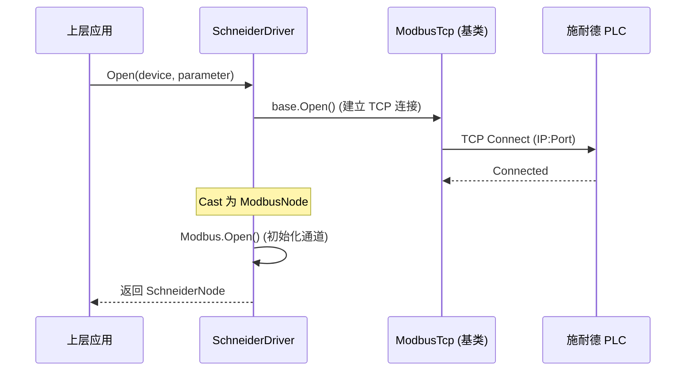
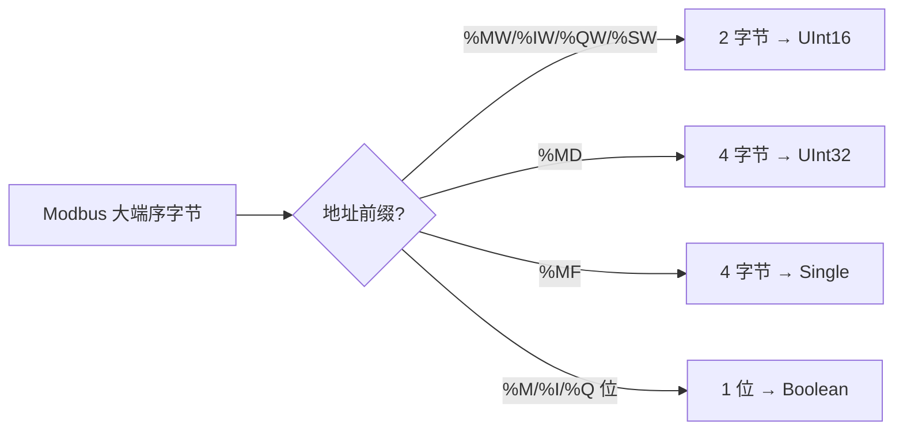

# NewLife.Schneider 架构设计

> 最后更新：2026-07-22 | 版本：v3.0

## 1. 项目定位与分层

NewLife.Schneider 是 NewLife IoT 生态中的施耐德 PLC 驱动组件，位于 **驱动层**。整体生态分层如下：

```
┌─────────────────────────────────────┐
│        IoT 平台层                    │
│  (ZeroIoT / IoTEdge / 星尘)         │
├─────────────────────────────────────┤
│        驱动抽象层 (NewLife.IoT)      │
│  IDriver / INode / IDriverParameter │
├─────────────────────────────────────┤
│        驱动实现层                    │
│  NewLife.Schneider    ← 本项目      │
│  NewLife.Siemens                   │
│  NewLife.Modbus                    │
├─────────────────────────────────────┤
│        传输协议层                    │
│  Modbus TCP / RTU / ASCII          │
└─────────────────────────────────────┘
```

### 1.1 项目内部层次

本项目为单项目结构，不拆分服务层或数据层，遵循「两层架构」：

```
表现层（无）   ← 纯类库，无 UI
    ↓
驱动层         ← SchneiderDriver / SchneiderNode / SchneiderParameter
    ↓
协议扩展层     ← SchneiderAddress / SchneiderModel / SchneiderFunctionCodes
                    类型转换层 (ConvertToTypedValue / GetTagPrefix)
    ↓
基础依赖       ← NewLife.IoT (标准抽象) + NewLife.Modbus (Modbus 实现)
```

## 2. 模块与组件

### 2.1 DRV — 驱动核心

| 组件 | 类名 | 所在文件 | 职责 |
|------|------|----------|------|
| 驱动入口 | `SchneiderDriver` | `Drivers/SchneiderDriver.cs` | 驱动注册入口，继承 ModbusTcpDriver，提供标签式读写 API 和自动类型转换 |
| 连接节点 | `SchneiderNode` | `Drivers/SchneiderNode.cs` | 封装单次设备连接状态，实现 INode |
| 连接参数 | `SchneiderParameter` | `Drivers/SchneiderParameter.cs` | 继承 ModbusTcpParameter，提供施耐德 PLC 参数配置 |

### 2.2 PRT — 协议扩展

| 组件 | 类名 | 所在文件 | 职责 |
|------|------|----------|------|
| 施耐德专用协议 | — | `Protocols/`（空） | 预留扩展目录 |
| 地址解析器 | `SchneiderAddress` | `Drivers/SchneiderAddress.cs` | 解析 `%MW`/`%M` 等施耐德寻址语法，映射到 Modbus 地址、功能码和数据类型 |
| 功能码常量 | `SchneiderFunctionCodes` | `Drivers/SchneiderFunctionCodes.cs` | 施耐德相关 Modbus 功能码常量定义 |
| 型号预设 | `SchneiderModel` | `Drivers/SchneiderModel.cs` | M200/M221 等常见型号的预设参数（端口、功能码、寄存器限制） |
| 类型转换器 | `SchneiderDriver`(静态方法) | `Drivers/SchneiderDriver.cs` | `ConvertToTypedValue`/`GetTagPrefix` 将 Modbus 大端序字节自动转换为对应 .NET 类型 |

### 2.3 TST — 测试验证

| 组件 | 类名 | 所在文件 | 职责 |
|------|------|----------|------|
| 手动测试 | `Program` | `Test/Program.cs` | 控制台手动测试程序 |
| 单元测试 | — | `XUnitTest/` | xUnit 自动化测试项目，58 个测试覆盖全部功能 |

## 3. 核心流程

### 3.1 驱动打开流程



### 3.2 标签式读写流程（含类型转换）

```mermaid
sequenceDiagram
    participant App as 上层应用
    participant Driver as SchneiderDriver
    participant Modbus as ModbusTcpDriver (基类)
    participant PLC as 施耐德 PLC

    App->>Driver: ReadTag(node, "MF100")
    Driver->>Driver: SchneiderAddress.Parse("MF100")
    Note over Driver: Type=HoldingRegister, Length=2
    Driver->>Driver: CreatePoint → Type="Float"
    Driver->>Modbus: ReadAsync (FC03, address=100, count=2)
    Modbus->>PLC: Modbus TCP Request
    PLC-->>Modbus: [0x40, 0x49, 0x0F, 0xDB] (大端)
    Modbus-->>Driver: Byte[4]
    Driver->>Driver: ConvertToTypedValue → Single(3.14159f)
    Driver-->>App: 3.14159f

    App->>Driver: ReadTagValue&lt;Single&gt;(node, "MF100")
    Driver->>Driver: ReadTag → ConvertToTypedValue → Single
    Driver-->>App: 3.14159f

    App->>Driver: WriteTag(node, "MW100", (UInt16)42)
    Driver->>Driver: SchneiderAddress.Parse("MW100")
    Driver->>Modbus: WriteAsync (FC06, address=100, value=[0x00, 0x2A])
    Modbus->>PLC: Modbus TCP Request
    PLC-->>Modbus: Modbus TCP Response
    Modbus-->>Driver: 写入结果
    Driver-->>App: 写入结果
```

### 3.3 类型转换流程



## 4. 关键设计决策

| 决策 | 选择 | 理由 |
|------|------|------|
| 通信协议 | Modbus TCP | 施耐德主流 PLC（如 M200/M221/M241/M251/M258/M262）均支持 Modbus TCP，无需私有协议 |
| 基类选择 | 继承 ModbusTcpDriver | 最大化复用 NewLife.Modbus 的现有 Modbus TCP 实现，避免重复造轮子 |
| 驱动发现 | `[Driver("SchneiderPLC")]` 特性 | 符合 NewLife.IoT 驱动发现规范，IoT 平台可自动扫描并加载驱动 |
| 日志与追踪 | 实现 ILogFeature / ITracerFeature | 复用 NewLife 基础设施，支持统一日志和 APM 性能追踪 |
| 类型转换策略 | 静态方法 + 标签前缀推断 | 无需物模型配置，纯内存计算，零额外依赖 |
| 目标框架 | netstandard2.1/2.0 + net461/net45 | 兼顾 .NET Framework 老旧系统与 .NET Core/5+ 现代应用 |

## 5. 外部依赖

| 包名 | 版本 | 用途 |
|------|------|------|
| `NewLife.IoT` | 3.0.2026.601 | IoT 标准抽象（IDriver/INode 等接口） |
| `NewLife.Modbus` | 2.0.2026.610 | Modbus TCP 协议实现（ModbusTcpDriver 基类） |

## 6. 待补充内容

以下内容需要人工补充完善：

- **性能指标**：单连接吞吐、最大并发连接数等基准测试数据
- **兼容性矩阵**：已验证的施耐德 PLC 型号列表
- **CI/CD 流程**：GitHub Actions 发布流水线（已有 `publish.yml` / `test.yml`，可补充架构说明）

